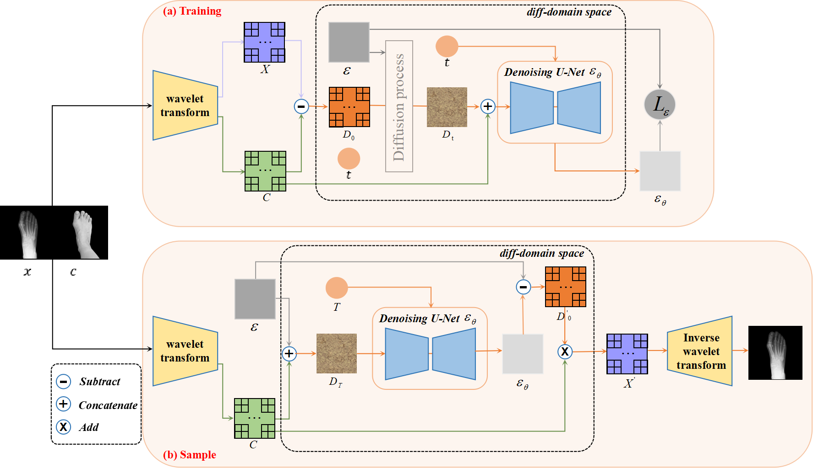
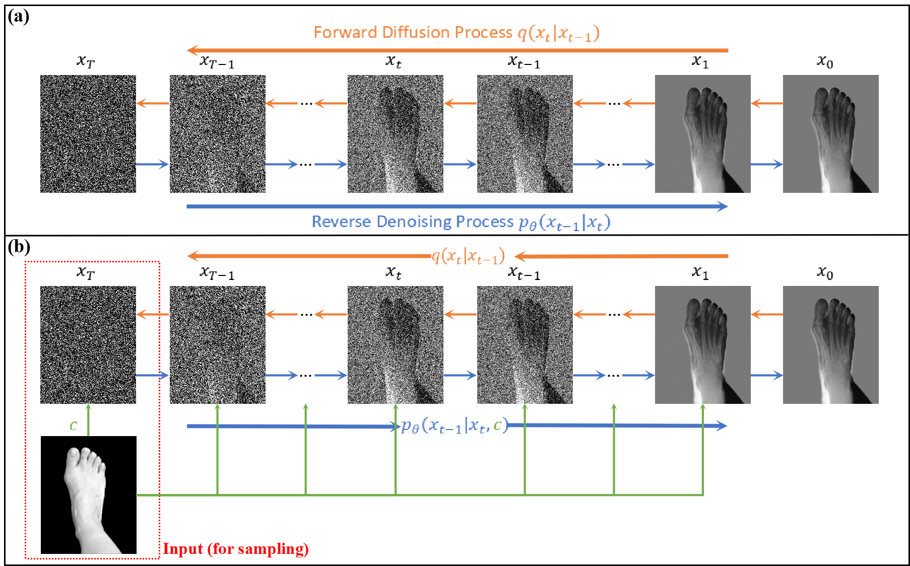

# Med-D3CG: Wavelet-Based Diffusion in the Difference Domain for Cross-Modality Medical Image Generation
## 📌 Overview
**Med-D3CG (Differential Domain Medical Diffusion for Conditional Generation)** is a novel framework for cross-modal medical image synthesis. Instead of directly generating target images, Med-D3CG models the difference domain between conditioned and target images, capturing structural and intensity variations more effectively. The framework leverages Discrete Wavelet Transform (DWT) to enhance efficiency, accelerating the diffusion process while maintaining high image fidelity.

The overview of Med-D3CG:


The diffusion process:


### ✨ Key Features
- **Difference Domain**: Captures residual information rather than directly synthesizing images.
- **Wavelet Module  **: Uses DWT and IDWT to accelerate the diffusion process.
- **Supports Multiple Modalities  **: Supports cross-modality translation.

  

## 🛠️ Installation
### Requirements
- Python 3.12+
- PyTorch 2.4.1+

### Setup
Clone the repository and install dependencies:
```bash
git clone https://github.com/midisec/Med-D3CG.git
cd Med-D3CG
pip install -r requirements.txt
```

---

## 🚀 Usage
To prepare the dataset, organize your data into multiple subfolders, where each subfolder represents a single sample. Each subfolder should contain **two PNG images**:

- One **original image** (filename starting with `"original"`).
- One **X-ray image** (filename starting with `"xray"`).

```
dataset/
│── sample1/
│   ├── original_1.png  # Original image
│   ├── xray_1.png      # X-ray image
│
│── sample2/
│   ├── original_2.png
│   ├── xray_2.png
│
│── sample3/
│   ├── original_3.png
│   ├── xray_3.png
│
│── ...
```

### 1️⃣ Training the Model

```bash
python train.py --model_name D3CG --dataset_train_dir path/to/dataset --dataset_val_dir path/to/dataset --n_epochs 2000 --batch_size 2
```

### 2️⃣ Evaluating the Model

Make sure to set the model file, output folder, and test dataset folder before running the following command

```bash
python pinggu.py
```

---


## 📜 Citation
If you find this work useful, please cite our paper:
```
@article{zhu2025med,
  title={Med-D3CG: Wavelet-Based Diffusion in the Difference Domain for Cross-Modality Medical Image Generation},
  author={Zhu, Guangzhen and Wan, Midi and Cao, Wenming and Yu, Zhiwen and Hu, Jin and Li, Bing and Fan, Xiaotao},
  journal={Expert Systems with Applications},
  pages={129651},
  year={2025},
  publisher={Elsevier}
}
```
